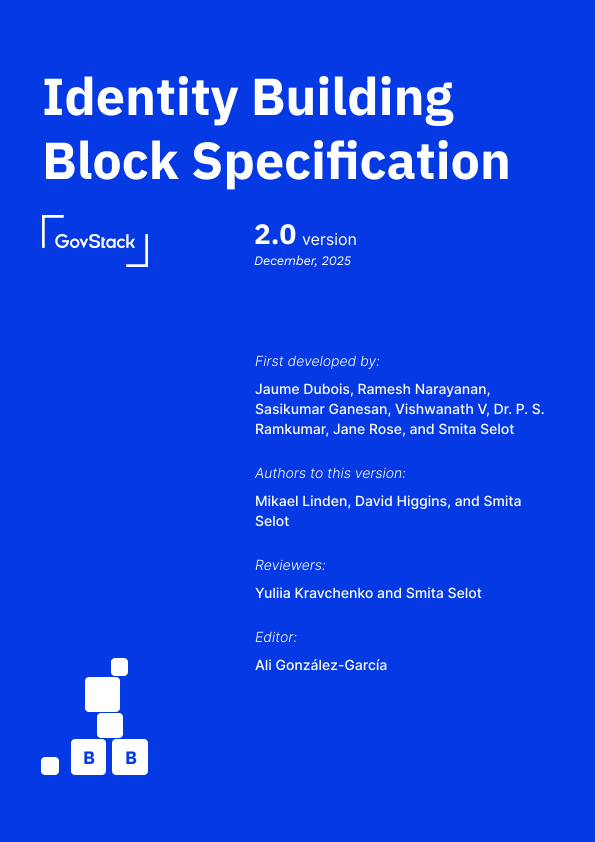

# Identity Building Block Specification

_**First developed by:**_\
Jaume Dubois (ID30), Ramesh Narayanan (MOSIP), Sasikumar Ganesan (MOSIP), Vishwanath V (MOSIP), Dr. P. S. Ramkumar (ITU), Jane Rose (Technoforte), Smita Selot

***

_**Authors to this version:**_\
Mikael Linden (Gofore) and David Higgins (Brook IT Consulting), and Smita Selot

_**Contributors:**_\
Charity Chirowamhangu, Antony Muriithi, Daniel Abadie, Norbert Nahayo, Rounak Nayak, Eric Ramirez, and Mary Metias

_**Reviewers:**_\
Yuliia Kravchenko, Smita Selot

_**Editor:**_\
Ali González-García

<figure><figcaption>
Identity BB Cover
</figcaption></figure>
